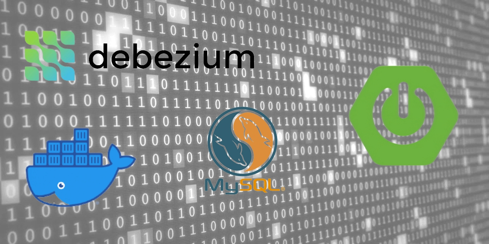

# Spring Boot + Debezium + MySQL


## INTRODUCTION
Debezium is a distributed platform used to implement Change Data Capture (a.k.a CDC) from SQL and NoSQL databases into event streams, enabling applications to detect and immediately respond to row-level changes in the databases. Debezium is built on top of Apache Kafka and provides a set of Kafka Connect compatible connectors. Each of the connectors works with a specific database.

<br>

## OVERVIEW
In this project, I implement the Debezium service programmatically, and run via Docker a MySQL database server with an example table in order to monitor for all events about data insertion or change.

<br>

## PREREQUISITES
- Java
- Docker

<br>

## HOW TO TEST
1. Boot up a MySQL instance with Docker:
```shell
$ docker run --name mysql -e MYSQL_ROOT_PASSWORD=root -e MYSQL_USER=user -e MYSQL_PASSWORD=password -e MYSQL_DATABASE=customerdb -p 3306:3306 --rm -it mysql --binlog-format=ROW --binlog-row-image=FULL --binlog-rows-query-log-events=ON --performance-schema=ON
```
### DESCRIPTIONS OF MYSQL BINLOG CONFIGURATION PROPERTIES
| Property | Description |
| :------- | :---------- |
| server-id | The value for the server-id must be unique for each server and replication client in the MySQL cluster. During MySQL connector set up, Debezium assigns a unique server ID to the connector. |
| log_bin | The value of log_bin is the base name of the sequence of binlog files. |
| binlog_format | The binlog-format must be set to ROW or row. |
| binlog_row_image | The binlog_row_image must be set to FULL or full. |
| expire_logs_days | This is the number of days for automatic binlog file removal. The default is 0, which means no automatic removal. Set the value to match the needs of your environment. See MySQL purges binlog files. |

For more information visit this [link](https://debezium.io/documentation/reference/stable/connectors/mysql.html#:~:text=Descriptions%20of%20MySQL%20binlog%20configuration%20properties).

2. Connect to MySQL docker instance:
```shell
docker exec -it mysql bash
```

3. Once inside, login into MySQL server:
```shell
mysql --user=user --password=password
```

4. Once logged in, create the database and table to run the demo application:
```shell
mysql> CREATE DATABASE customerdb;
Query OK, 1 row affected (0.01 sec)
```
```shell
mysql> USE customerdb;
Database changed
```
```shell
mysql> CREATE TABLE customer ( id bigint NOT NULL AUTO_INCREMENT, email varchar(255) DEFAULT NULL, fullname varchar(255) DEFAULT NULL, PRIMARY KEY (id) );
Query OK, 0 rows affected (0.02 sec)
```

5. Logout from the MySQL server and disconnect from the instance:
```shell
mysql> exit
exit
```

6. Run the application:
```shell
./mvnw spring-boot:run
```

7. From another terminal, log in again into the docker instance and then into the MySQL server. Once logged in, insert some random data into the `customerdb` table:
```shell
mysql> INSERT INTO customerdb.customer (fullname, email) VALUES(CAST(NOW() AS CHAR), CAST(NOW() AS CHAR));
Query OK, 1 row affected (0.01 sec)
```

7. From the application's console, you should see a data insertion event log similar to the one below:
```shell
2022-06-28 10:46:59.493  INFO 2009800 --- [pool-1-thread-1] i.d.connector.common.BaseSourceTask      : 1 records sent during previous 00:00:24.117, last recorded offset: {transaction_id=null, ts_sec=1656424019, file=binlog.000002, pos=7258, row=1, server_id=1, event=3}
2022-06-28 10:46:59.493  INFO 2009800 --- [pool-1-thread-1] i.d.listener.DebeziumListener            : Key = Struct{id=3}, Value = Struct{after=Struct{id=3,email=2022-06-28 13:46:59,fullname=2022-06-28 13:46:59},source=Struct{version=1.9.4.Final,connector=mysql,name=customer-mysql-db-server,ts_ms=1656424019000,db=customerdb,table=customer,server_id=1,file=binlog.000002,pos=7604,row=0,thread=23},op=c,ts_ms=1656424019483}
2022-06-28 10:46:59.493  INFO 2009800 --- [pool-1-thread-1] i.d.listener.DebeziumListener            : SourceRecordChangeValue = 'Struct{after=Struct{id=3,email=2022-06-28 13:46:59,fullname=2022-06-28 13:46:59},source=Struct{version=1.9.4.Final,connector=mysql,name=customer-mysql-db-server,ts_ms=1656424019000,db=customerdb,table=customer,server_id=1,file=binlog.000002,pos=7604,row=0,thread=23},op=c,ts_ms=1656424019483}'
```
